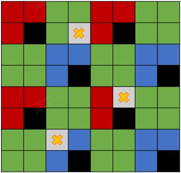
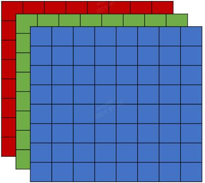
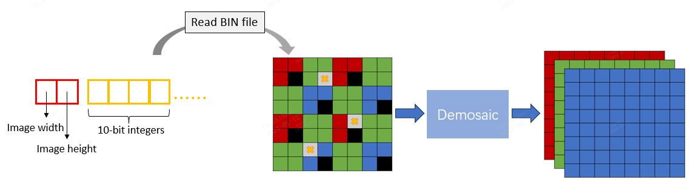

# README

## Overview
All data is hosted on Google Drive, and the training data is shown below:

| Path                                                                                    | Files | Format | Description                                                     | CFA
|:----------------------------------------------------------------------------------------|------:|:------:|:----------------------------------------------------------------| :---------------
| training_dataset                                                                |       |        | Main folder                                                     |      
| &#9500;&#9472;&nbsp; input                                                              |       |        | Input Hybridevs dataset <br/>     | 
| &nbsp;&nbsp;&nbsp;&nbsp;&nbsp;&nbsp;&#9500;&#9472;&nbsp; input.zip  |    800 |  .bin  | Hybirdevs input       |
| &#9500;&#9472;&nbsp; GT_bayer                                                           |       |        | Ground Truth dataset  <br/> | 
| &nbsp;&nbsp;&nbsp;&nbsp;&nbsp;&nbsp;&#9500;&#9472;&nbsp; train_bayer_full_gt.zip        |    800 |  .png  | GT     |


## Dataset

1. Download the training data (800 scenes) [here](https://drive.google.com/drive/folders/1Yi4ZqNm-0AfdWm8gzLAhxX9ooIWkhqZt?usp=drive_link).

2. Input data with `.bin` files can be read using the Python functions in `data_scripts/`.

    ```bash
    python data_scripts/process_function.py
    ```

## Data process
1. A python script is provided under `data_scipts/` to read the raw data of the .bin format. 
2. The first two chars in BIN files are the width and height of the raw image, and the remaining are the image data. 




## Contacts

For any questions, please contact

xxx@teteras.site<br/>
